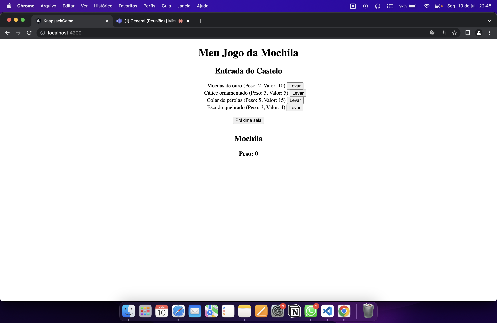
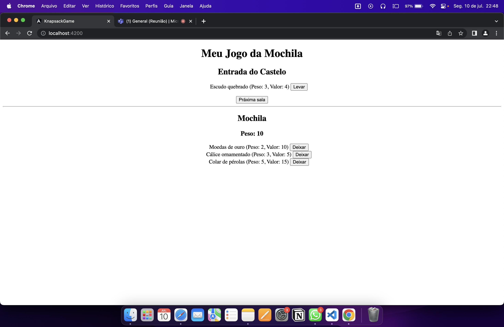
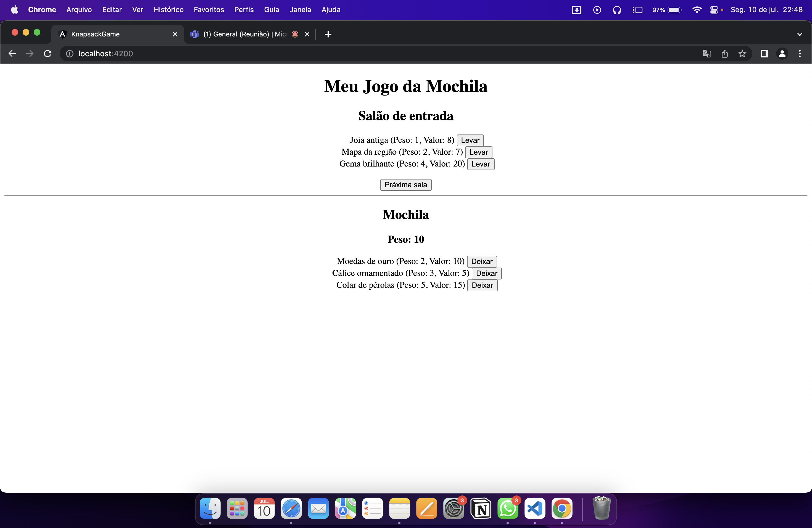
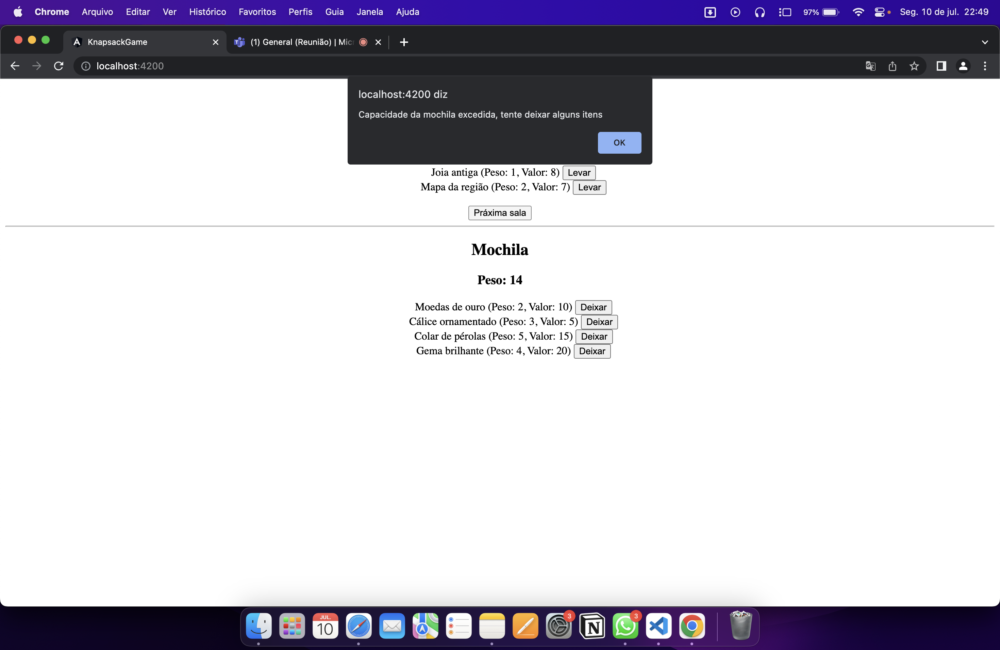

# PD_KnapsackGame

## Alunos

|Matrícula | Aluno |

| -- | -- |

| 19/0020407  |  Thiago Vivan Bastos |

| 20/0069322  |  Samuel Alves Sato   |

## Sobre

O Objetivo desse trabalho é aplicar o Algoritmo Knapsack em um pequeno jogo de RGP em que um personagem passa por várias salas e deve escolher quais itens levar, tendo como base que sua mochila tem capacidade de 10.

## Screenshots

## Instalação

**Linguagem**: TypeScript 

**Framework**: Angular 

É necessário possuir gerenciador de pacotes npm.

- Baixe o repositório localmente.

- Baixe o Angular CLI: `npm install -g @angular/cli`

- Na pasta do projeto execute: `npm install`

- Para executar o projeto: `ng serve`

- Projeto será executado no `localhost:4200`

## Uso

- Adicione ou retire itens da sua mochila.

- Siga para as proximas salas

- Ao decidir seguir para a proxima sala será exibido alerta informando qual era o melhor arranjo de itens até aquele momento.

## Outros
